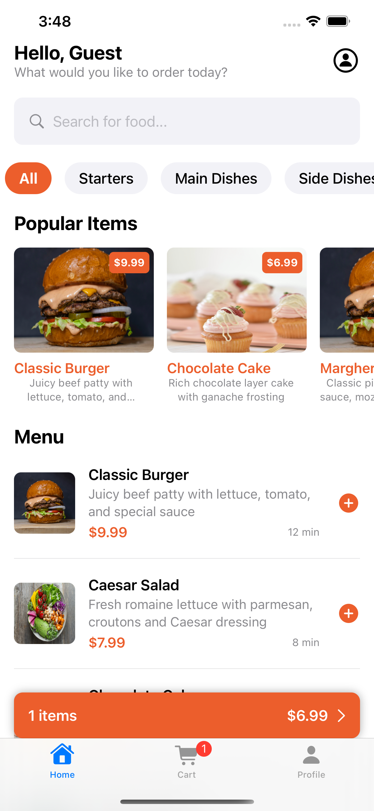
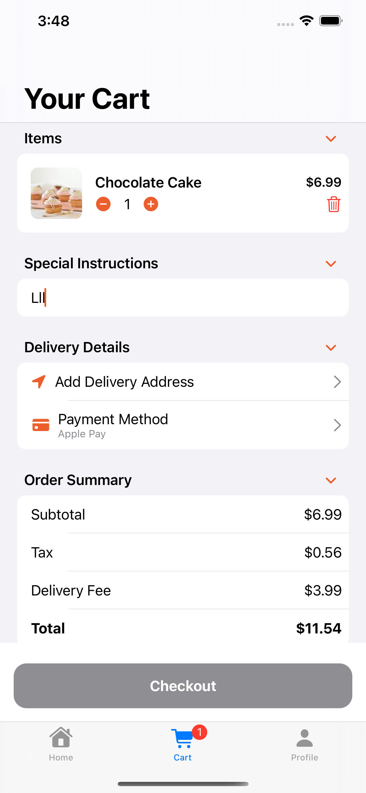

# Menu Order App

A modern, feature-rich iOS application for food ordering with a beautiful UI/UX design. This app allows users to browse menus, customize orders, track deliveries, and manage their profiles.

## Screenshots

<table>
  <tr>
    <td align="center"><strong>Home Screen</strong></td>
    <td align="center"><strong>Detail View</strong></td>
  </tr>
  <tr>
    <td></td>
    <td></td>
  </tr>
</table>

## Features

### For Customers
- **Browse Menu**: Explore food items by categories with detailed descriptions
- **Search Functionality**: Easily find specific items with search
- **Item Details**: View ingredients, nutritional information, and allergen details
- **Customizable Orders**: Add special instructions and customize quantity
- **Shopping Cart**: Review and modify your order before checkout
- **Order Tracking**: Follow the status of your order in real-time
- **User Profiles**: Save delivery addresses and payment methods
- **Order History**: View past orders and easily reorder favorites
- **Loyalty Program**: Earn points for each purchase

### App Highlights
- Modern SwiftUI interface
- MVVM architecture
- Detailed food item information
- Smooth animations and transitions
- Real-time order updates
- User-friendly cart management
- Multiple payment options

## Technical Details

### Architecture
- **Pattern**: MVVM (Model-View-ViewModel)
- **UI Framework**: SwiftUI
- **Swift Version**: 5.0+

### Key Components
- **Models**: MenuItem, Order, UserProfile
- **Views**: HomeView, CartView, ProfileView, MenuItemDetailView
- **Services**: MenuDataStore

## Getting Started

1. Clone the repository
2. Open `MenuOrderApp.xcodeproj` in Xcode
3. Build and run the project on your preferred iOS simulator or device

## Requirements
- iOS 15.0+
- Xcode 13.0+
- Swift 5.0+

## Future Enhancements
- Real-time notifications for order updates
- Integration with payment gateways
- Social media sharing
- Ratings and reviews system
- Advanced filtering options

## Created by
Andy Chen
